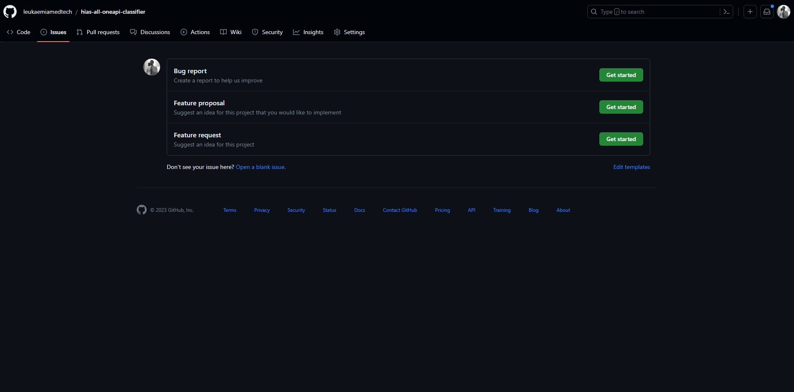
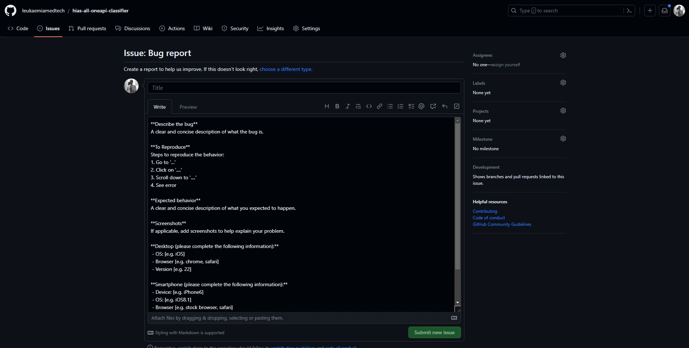
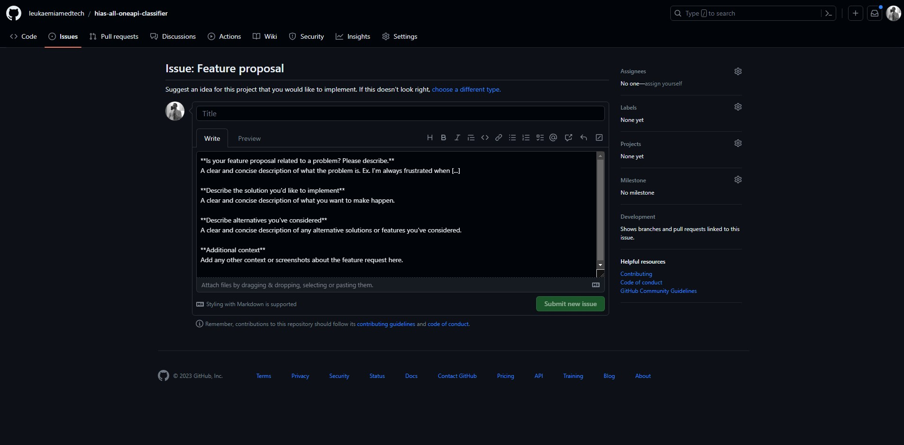
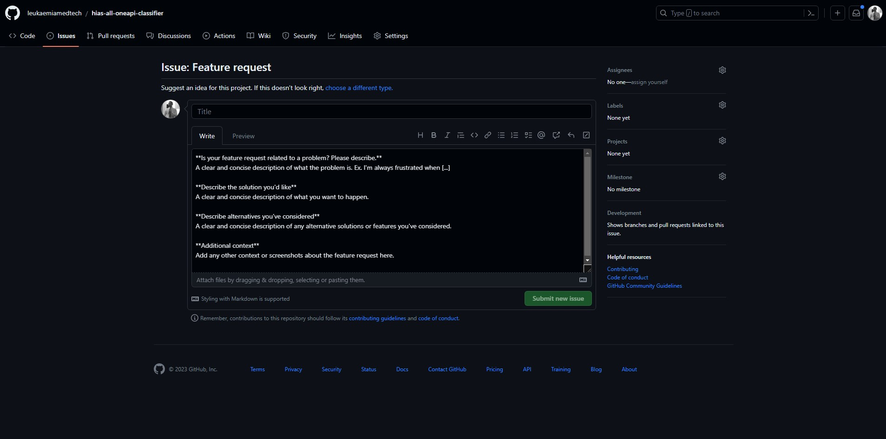
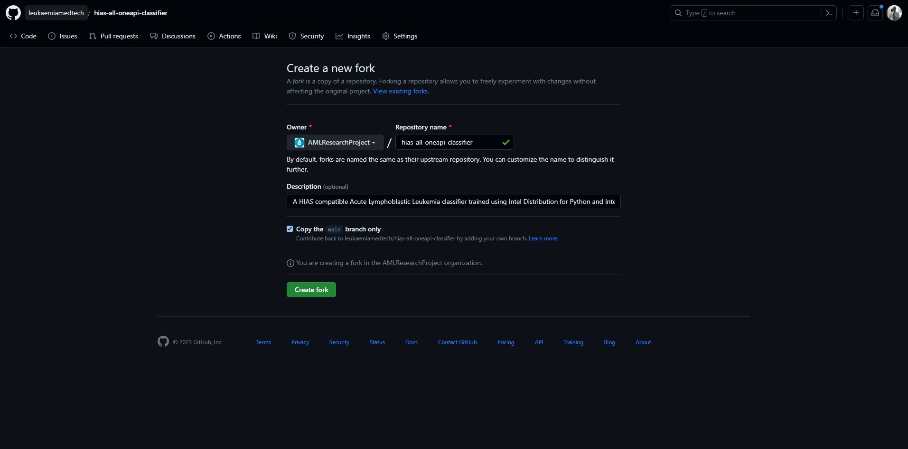

# Contributing to Peter Moss Leukaemia MedTech Research CIC AI Agent projects

Peter Moss Leukaemia MedTech Research CIC encourages and welcomes code contributions, bug fixes and enhancements from the Github community.

## Ground rules & expectations

Before we get started, here are a few things we expect from you (and that you should expect from others):

- Be kind and thoughtful in your conversations around this project. We all come from different backgrounds and projects, which means we likely have different perspectives on "how open source is done." Try to listen to others rather than convince them that your way is correct.
- Our projects are released with a [Contributor Code of Conduct](CODE-OF-CONDUCT.md). By participating in our projects, you agree to abide by its terms.
- Please ensure that your contribution complies with this document. If it does not, you will need to address and fix all issues before we can merge your contribution.
- When adding content, please consider if it is widely valuable.

## Overview

Being an Open Source project, everyone can contribute, provided that you respect the following points:

- Before contributing any code, the author must make sure all the tests work (see below how to launch the tests).
- Developed code must adhere to the syntax guidelines enforced by the linters.
-  Code must be developed following the [SemVer (Semantic Versioning 2.0.0)](https://semver.org/) branching model.
- For any new feature added, unit tests must be provided, following the example of the ones already created.

## PEP 8 -- Style Guide for Python Code

All Python projects must align with the [PEP 8 -- Style Guide for Python Code](https://www.python.org/dev/peps/pep-0008/).

## CII Best Practices

All projects must align with the [CII Best Practice](https://www.construction-institute.org/resources/knowledgebase/best-practices).

# How to contribute

If you'd like to contribute, start by searching through the issues and pull requests to see whether someone else has raised a similar idea or question.

If you don't see your idea listed, and you think it fits into the goals of this guide, do one of the following:

- Bug Report
- Feature Proposal
- Feature Request
- Vulnerability Report

## Repository Issues

The first step is to head to our repository issues tab and decide how you would like to contribute.



## Bug reports



If you would like to contribute bug fixes or make the team aware of bugs you have identified in the project, please raise a **Bug report** issue in the [issues section](issues/new/choose) section. A template is provided that will allow you to provide your suggestions for your bug report / bug fix(es) which will be reviewed by the team.

If your intention is to contribute to the project by fixing the issue yourself, you should wait until an admin has approved your bug fix proposal before beginning to develop anything.

## Feature proposals



A feature proposal is the way to propose a new feature for a project that you would like to develop and contribute to the project.

If you would like to contribute new features to the project, please raise a **Feature proposal** issue in the [issues section](issues/new/choose) section. A template is provided that will allow you to provide your suggestions for your feature proposal.

If your feature proposal is approved a new branch will be created for your based on the current development branch. You should wait until an admin has approved your feature proposal before beginning to develop anything.

## Feature requests



If you would like to suggest a new feature/new features for this project, please raise a **Feature request** issue in the [issues section](issues/new/choose) section. A template is provided that will allow you to provide your suggestions for your feature request.

## Community

Discussions about the Open Source Guides take place on this repository's [Issues](issues) and [Pull Requests](pulls) sections, or the [discussions](discussions). Anybody is welcome to join these conversations.

Wherever possible, do not take these conversations to private channels, including contacting the maintainers directly. Keeping communication public means everybody can benefit and learn from the conversation.

# Getting Started

Once your bug fix or feature proposal has been approved, you can begin development. A project admin will create a branch based on the develop branch, this branch will be specific to your bug fix or feature proposal. Once the branch has been created you will be notified by a team member in your issue. Once this happens you can get started by following the next steps.



1. Fork the repository for the project you to want to contribute to by clicking on the "Fork" button on the upper-right area of the repository. We will use the [HIAS ALL oneAPI Classifier](https://github.com/leukaemiamedtech/hias-all-oneapi-classifier) project as an example.

2. Clone your just forked repository:

```bash
git clone https://github.com/YourAccount/hias-all-oneapi-classifier.git
```

3. Add the main repository as a remote to your forked repository:

```bash
git remote add upstream https://github.com/AIIAL/hias-all-oneapi-classifier.git
```

Before starting your contribution, remember to synchronize your local branch with the `develop` branch in the upstream repository. To do this, use following these steps

1. Fetch the upstream branches

```bash 
git fetch upstream
```

2. Change to your local branch (in case you are not in it already):

```bash
git checkout YourBranch
```

3. Merge the upstream `develop` branch with your local branch:

```bash
git merge upstream/develop
```

# Documentation

Changes you make to the code in the repository or new projects that you make should be supported with documentation added to the **docs** directory.

It is the contributor's responsibility to ensure that the documentation is up to date. If you are contributing to an existing repository you will ensure that these documents are updated and/or added to to reflect your changes.

We use [MKDocs](https://www.mkdocs.org/) along with [Read the Docs](https://docs.readthedocs.io/en/stable/index.html). Use the [Getting Started with MkDocs](https://docs.readthedocs.io/en/stable/intro/getting-started-with-mkdocs.html) guide to find out how to update/create documentation for the project.

To start the MKDocs server on use the following command:

``` bash
mkdocs serve
```
To start the MKDocs on a specific IP and port use the following command, updating your IP and port as required:

``` bash
mkdocs serve -a 192.168.1.578:8000
```
Remember to update the [mkdocs.yml](mkdocs.yml) file to match your documentation structure.

# Repository structure

Repository structures for HIAS AI Agents **must be followed exactly** for all contributions. Pull Requests that do not follow this structure will be rejected and closed with no further discussion.

```
- Project Root (Directory)
    - assets (Directory)
        - img (Directory)
            - project-banner.jpg (Image)
    - configuration (Directory)
        - config.json (File)
    - docs (Directory)
        - img (Directory)
            - project-banner.jpg (image)
        - installation (Directory)
            - ubuntu.md (File)
        - usage (Directory)
            - ubuntu.md (File)
        - index.md (File)
    - logs (Directory)
        - Auto generated log files
    - modules (Directory)
        - AbstractClassifier.py (File)
        - AbstractData.py (File)
        - AbstractModel.py (File)
        - AbstractServer.py (File)
        - helpers.py (File)
        - augmentation.py (File)
        - data.py (File)
        - model.py (File)
        - server.py (File)
    - model (Directory)
        - data (Directory)
            - test (Directory)
            - train (Directory)
            - plots (Directory)
        - model.json (File)
        - weights.h (File)
    - notebooks (Directory)
        - classifier.ipynb (File)
    - scripts
        - install.sh (File)
    - agent.py (File)
    - LICENSE (File)
    - mkdocs.yml (File)
    - README.md (File)
```

**Directories and files may be added to the above structure as required, but none must be removed.**

# Installation Scripts

The default installation script is [install.sh](scripts/install.sh) found in the [scripts](scripts) directory.

You must include the installation commands for all libraries for the project using apt/pip/make etc. Replace **# DEVELOPER TO ADD INSTALLATION COMMANDS FOR ALL REQUIRED LIBRARIES (apt/pip etc)** with the relevant installation commands. If you are contributing an existing repository you will ensure that these scripts are updated to reflect your changes.

# Configuration

The project configuration file [config.json](configuration/config.json) can be found in the [configuration](configuration) directory.

All configurable variables should be held within this file and used wherever relevant throughout the project.

The [helpers file](modules/helpers.py) loads the configuration and makes it available as `helpers.confs`.

You may remove redundent objects/arrays/values. from the configuration and/or add new ones.

# Project Images

Images used in the project must be **jpg**. You must own rights to images you upload to the project, or include attribution. Contributors are solely responsible for any images they publish to our Github.

# Naming Scheme

The following naming scheme must be used:

- **Directories:** Snake case (snake_case)
- **Abstract Files:** CamelCase (CamelCase)
- **Files:** Spinal case (spinal-case)
- **Images:** Spinal case (spinal-case)

Please use descriptive but short names, and make sure to not use spaces in directory and file names.

# Headers

All Python files must include the following header, replacing **Module Title** with a short but descriptive title for the module, and **Module Description** with a paragraph explaining what the module is for.

```
#!/usr/bin/env python3
""" Module Title.

Module Description.

MIT License

Copyright (c) Peter Moss Leukaemia MedTech Research CIC

Permission is hereby granted, free of charge, to any person obtaining a copy
of this software and associated documentation files(the "Software"), to deal
in the Software without restriction, including without limitation the rights
to use, copy, modify, merge, publish, distribute, sublicense, and / or sell
copies of the Software, and to permit persons to whom the Software is
furnished to do so, subject to the following conditions:

The above copyright notice and this permission notice shall be included in all
copies or substantial portions of the Software.

THE SOFTWARE IS PROVIDED "AS IS", WITHOUT WARRANTY OF ANY KIND, EXPRESS OR
IMPLIED, INCLUDING BUT NOT LIMITED TO THE WARRANTIES OF MERCHANTABILITY,
FITNESS FOR A PARTICULAR PURPOSE AND NONINFRINGEMENT. IN NO EVENT SHALL THE
AUTHORS OR COPYRIGHT HOLDERS BE LIABLE FOR ANY CLAIM, DAMAGES OR OTHER
LIABILITY, WHETHER IN AN ACTION OF CONTRACT, TORT OR OTHERWISE, ARISING FROM,
OUT OF OR IN CONNECTION WITH THE SOFTWARE OR THE USE OR OTHER DEALINGS IN THE
SOFTWARE.

Contributors:

"""
```

# Attribution

- When you create a new module you should add your name to the **Contributors** section.
- When you make a change to an existing module you should add your name to the **Contributors** section below existing contributors. You must not remove existing contributors.

# Footers

All READMEs and documentation should include the following footer:

```
# Contributing
Peter Moss Leukaemia MedTech Research CIC encourages and welcomes code contributions, bug fixes and enhancements from the Github community.

Please read the [AI AGENT CONTRIBUTING](https://github.com/leukaemiamedtech/hias-all-oneapi-classifier/blob/master/CONTRIBUTING-AI-AGENTS.md "AI AGENT CONTRIBUTING") guide for a full guide to contributing to our AI Agent projects. You will also find our code of conduct in the [Code of Conduct](https://github.com/leukaemiamedtech/contributing-guide/blob/main/CODE-OF-CONDUCT.md) document.

## Contributors
- [Adam Milton-Barker](https://www.leukaemiamedtechresearch.org.uk/about/volunteers/adam-milton-barker "Adam Milton-Barker") - [Peter Moss Leukaemia MedTech Research CIC](https://www.leukaemiamedtechresearch.org.uk "Peter Moss Leukaemia MedTech Research CIC") Founder & Managing Director, North Wales.

&nbsp;

# Versioning
We use [SemVer](https://semver.org/) for versioning.

&nbsp;

# License
This project is licensed under the **MIT License** - see the [LICENSE](https://github.com/leukaemiamedtech/hias-all-oneapi-classifier/blob/main/LICENSE "LICENSE") file for details.

&nbsp;

# Bugs/Issues
We use the [repo issues](https://github.com/leukaemiamedtech/hias-all-oneapi-classifier/issues/new/choose "repo issues") to track bugs and general requests related to using this project. See [AI AGENT CONTRIBUTING](https://github.com/leukaemiamedtech/hias-all-oneapi-classifier/blob/master/CONTRIBUTING-AI-AGENTS.md "AI AGENT CONTRIBUTING") guide for more info on how to submit bugs, feature requests and proposals.
```

Remember to use **relative URLs**, and in the case of footers in the [docs](docs) folder, you must us **absolute URLs**.

The contributors section should include a list of contributors that have contributed to the related document. In the case of the README footer, the Contributors section should include a list of contributors that have contributed to **any** part of the project.

You should add your details below existing contributors. Details should include:

- Name
- Company/University etc
- Position

Peter Moss Leukaemia MedTech Research CIC Volunteers should use the following:

- Name
- CIC name
- CIC Position

# Branching model

There are two special branches in each repository:

- `main`: contains the tagged and released version
- `develop`: is the current development branch and contains the latest development code. New features and bugfixes are always merged to `develop` branch before being merged into `main`.

In order to start developing a new feature, fix a bug or refactor, a new branch will be created based on the nature of the work to be carried out and will include the related issue number. IE: 

- `feature-<issue number>`
- `bug-<issue number>`
- `hotfix-<issue number>`

Once development has been completed you should push your changes to your branch and then create a pull request to the origin branch. Once reviewed, these branches will be merged back into the `develop` branch. 

Once the `develop` branch has enough changes to justify a release, a release branch will be created based on the `develop` branch. The release branches follow the SemVer scheme:

`release-MAJOR-MINOR-PATCH`

Given a version number MAJOR.MINOR.PATCH, increment the:

- `MAJOR` version when you make incompatible code changes,
- `MINOR` version when you add functionality in a backwards compatible manner, and
- `PATCH` version when you make backwards compatible bug fixes.

- If `MAJOR` is 0, then Minor could mean the version is not backwards compatible
- If `MINOR` is 1, this means the release is stable.

# Changelog

The project contains a changelog that is automatically created from the description of the Pull Requests that have been merged into `develop`, thanks to the [Release Drafter GitHub action](https://github.com/marketplace/actions/release-drafter).

# Releasing

The process of making a release simply consists of creating the release in Github and providing the new tag name, this task is carried out by our team.

## Version numbers

The version number will change for each release, following the SemVer scheme described previously.

## Bugfix in releases

When a bug is found affecting a release, a branch will be created from the `develop` branch. As a part of the patch, the release version will be increased in it's last number (Z). The patch then will be merged (via pull request (PR)) to the `main` branch, and a new version will be released.

# Commits

Commits should be [atomic](https://en.wikipedia.org/wiki/Atomic_commit), make commits to your fork until you have resolved/completed the work specified in your issue before submitting your PR, this keeps an easy to follow history of what work has been carried out and makes the review process easier and quicker

When making a commit, the subjects of each commit should be as follows, where XXX represents the issue number:

## Commit Title

### Bug Fixes

- fix #xxx Issue Name
- fixes #xxx Issue Name
- fixed #xxx Issue Name

### Partial Resolutions

- partially resolves #xxx Issue Name
- partially resolved #xxx Issue Name

### Resolution

- resolves #xxx Issue Name
- resolved #xxx Issue Name

### Alignment

- aligns with #xxx Issue Name

### Closure

- close #xxx Issue Name
- closes #xxx Issue Name
- closed #xxx Issue Name

## Commit Description

Your commit description should include a detailed description of the changes that have been made.

## Committing

When you are ready to commit, you should do the following:

### Show The Status Of All Changed/Added/Deleted files

```
git status
```

### Diff

You may want to check the differences between changed files, you can do this using the following command.

```
git diff
```

### Add All Changes

The following will add all changes shown by git status to your commit.

```
git add .
```

### Add One Or More Changes

```
git add file1 file2 file5
```

### Commit Added Changes

Commit your added changes to your local repository, remember to follow the [Commit Title](#commit-title) & [Commit Description](#commit-description) guides above.

To create your commit with both a title and description, use the following command which states the commit fixes issue ID 1 and provides a detailed description:

```
git commit -m "fixes #1" -m "Fixes the documentation typos described in issue #1"
```

# Push Your Changes

When you have made your changes, ensured you have aligned with the procedures in this document, and made your commits to your local repository aligning with the guide above, you need to push your changes to your forked repository.

Push changes to your fork by using the following command:

```
git push
```

# Pull Request protocol

Contributions to our AI Agent projects are done using a PR. The detailed "protocol" used in such PR is described below:

* Direct commits to main or develop branches (even single-line modifications) are not allowed. Every modification has to come as a PR to the your branch
* PRs implement/fix submitted issues, the issue number has to be referenced in the subject of the relevant commit and PR
* Anybody is welcome to provide comments to the PR (either direct comments or using the review feature offered by Github)
* Use *code line comments* instead of *general comments*, for traceability reasons (see comments lifecycle below)
* Comments lifecycle
    * Comment is created, initiating a *comment thread*
    * New comments can be added as responses to the original one, starting a discussion
    * After discussion, the comment thread ends in one of the following ways:
        * `Fixed in <commit hash>` in case the discussion involves a fix in the PR branch (which commit hash is included as reference)
        * `NTC`, if finally nothing needs to be done (NTC = Nothing To Change)
* PR can be merged when the following conditions are met:
    * All comment threads are closed
    * All the participants in the discussion have provided a `LGTM` general comment (LGTM = Looks good to me)
    * All documentation has been updated to reflect your changes.
    * No proprietory software or images have been added.

* Self-merging is not allowed (except in rare and justified circumstances)

Some additional remarks to take into account when contributing with new PRs:

* PR must include not only code contributions, but their corresponding pieces of documentation (new or modifications to existing one) and tests
* Documentation must be added to the **docs** folder
* In the case empty directories need to be uploaded, add a `.gitkeep` file inside.
* The project banner is included in all documentation
* Contributing, Versioning, Licensing, Bugs/Issues footer is included in all information
* Contributors have been added to all Contributors footers
* PR modifications must pass full regression based on existing tests in addition to whichever new test added due to the new functionality
* PR should be of an appropriated size that makes review achievable. Too large PRs could be closed with a "please, redo the work in smaller pieces" without any further discussion